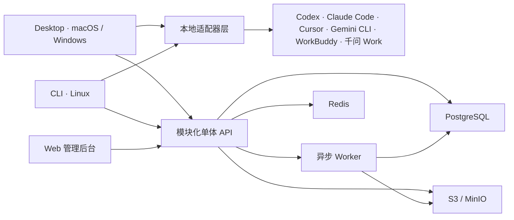

# CapaPort

CapaPort 是面向研发团队的组织级 AI 能力管理平台。它把 Skill、Prompt 和项目上下文统一为“能力包”，覆盖从本地发现、敏感信息扫描、沉淀审核，到跨 Agent 安装与安全更新的完整闭环。

产品由 macOS/Windows 桌面客户端、Linux CLI、Web 管理后台和 Docker 化云端服务组成。当前适配 Codex、Claude Code、Cursor、Gemini CLI、WorkBuddy 与千问 Work（QwenWork）；支持个人、组织、团队、项目四类空间，一个项目空间可绑定多个本地目录，但不会上传业务源码。

- 源码仓库：[github.com/qiujunbiao/CapaPort](https://github.com/qiujunbiao/CapaPort)
- 当前版本：`0.1.0`

## 能力范畴

CapaPort 管理的“能力”不是单一文件，而是可发现、可审查、可版本化、可分发的能力包。一个能力包可以组合：

- **Skill**：Agent 可执行的说明、工作流和辅助资源；
- **Prompt**：可复用的任务提示模板；
- **项目上下文**：架构约束、术语、规范、协作规则等显式选择的项目知识，默认不包含业务源码。

能力包通过 `capaport.yaml` 描述元数据、组件路径、兼容 Agent、权限和入口；发布版本绑定不可变制品与 SHA-256 内容摘要，同一版本号不能替换内容。

| 能力领域 | CapaPort 提供的能力 |
| --- | --- |
| 账号与组织 | 邮箱/手机号注册登录、验证与找回、组织创建与切换、邀请、成员角色、所有权移交、数据导出及关闭/注销宽限期 |
| 空间与权限 | 个人、组织、团队、项目四类空间；空间成员角色、审核策略、组织安全策略和跨租户强隔离 |
| 本地发现 | 发现 Codex、Claude Code、Cursor、Gemini CLI、WorkBuddy、千问 Work 的原生能力目录；支持可信技能根目录直接进入的目录符号链接，并拒绝断链、循环和能力目录内部越界链接 |
| 创作与版本 | 创建能力元数据、草稿和不可变修订；组合 Skill、Prompt 与项目上下文；维护语义化版本、差异和生命周期 |
| 安全扫描 | 上传前与服务端双重扫描凭据、令牌、私钥、连接串、高熵秘密、可执行文件、网络访问和路径越界；报告不回显秘密原文 |
| 审核与发布 | 按空间策略直接发布或进入审核；查看冻结摘要、版本差异和扫描报告；支持通过、要求修改、拒绝、撤回、重新提交、弃用、下架和归档 |
| 分发与安装 | 生成签名安装计划，校验兼容 Agent、版本与摘要；安装、更新、卸载前预览变更，并记录设备与安装状态 |
| 更新与冲突 | 使用安装锁和文件摘要识别本地修改，禁止静默覆盖；支持保留本地、导入为新草稿、恢复已安装版本、事务回滚和卸载回滚 |
| 项目上下文 | 一个项目空间绑定多个本地目录；显式选择可同步内容，生成面向不同 Agent 的原生格式，不把设备绝对路径或业务源码上传到云端 |
| 治理与审计 | 不可变审计日志、通知与死信重试、采用分析、安全中心、设备治理、账号/组织生命周期和运维指标 |
| 多端使用 | 桌面端覆盖本地发现、创作、安装和完整组织治理，能力范围不低于 Web 管理后台；Web 用于浏览器治理，CLI 用于 Linux 与自动化场景 |

### 产品边界

CapaPort 是能力治理与分发平台，不是 Agent 推理或任务执行引擎，也不是代码托管、任意文件同步或生产秘密管理系统。项目目录绑定保存在本地；只有用户明确选择并通过安全检查的能力文件和项目知识可以上传。安装写入只允许发生在已授权的 Agent 目录内。

## 架构



后端按账号、组织、空间、能力包、审核发布、分发安装、审计分析等领域模块组织，但以模块化单体方式部署。所有租户查询在服务端强制限定组织边界。

## 客户端兼容矩阵

| 客户端 | 用户级 Skill | 项目级 Skill | Prompt | 项目上下文 |
| --- | --- | --- | --- | --- |
| Codex | `.agents/skills/`、`.codex/skills/` | `.agents/skills/` | 不支持 | 不支持 |
| Claude Code | `.claude/skills/` | `.claude/skills/` | 支持 | 支持 |
| Cursor | `.cursor/skills/` | `.cursor/skills/` | 支持 | 支持 |
| Gemini CLI | `.gemini/skills/` | `.gemini/skills/` | 支持 | 不支持 |
| WorkBuddy | `~/.workbuddy/skills/` | `.codebuddy/skills/` | 不支持 | 不支持 |
| 千问 Work（QwenWork） | `~/.qwenworkcn/skills/` | 不支持 | 不支持 | 不支持 |

WorkBuddy 与千问 Work 的 Skill 会完整保留 `SKILL.md`、`scripts/`、`references/`、`assets/` 等辅助文件。请求未支持的 scope 或组件时，CapaPort 会明确拒绝，不会回退到其他目录或转换组件格式。

## 一键本地运行

要求：Git、Docker Desktop 或 Docker Engine + Compose v2。克隆仓库后执行：

```bash
git clone https://github.com/qiujunbiao/CapaPort.git
cd CapaPort
docker compose -f infra/compose/compose.yaml up -d --build --wait
```

打开：

- Web 管理后台：<http://127.0.0.1:1430>
- API 健康检查：<http://127.0.0.1:3210/api/v1/health/ready>
- 开发邮件箱：<http://127.0.0.1:8025>

开发环境登录验证码会进入 Mailpit。默认凭据只用于本地开发，不得用于生产。停止并保留数据用 `pnpm docker:down`；连同数据卷清理用：

```bash
docker compose -f infra/compose/compose.yaml down -v
```

## 从源码开发

要求 Node.js 22、pnpm 11.16、Rust stable（仅桌面原生端需要）和 Docker。

```bash
corepack enable
pnpm install --frozen-lockfile
pnpm build
pnpm test
pnpm dev
```

常用入口：

```bash
pnpm --filter @capaport/web dev
pnpm --filter @capaport/desktop dev
pnpm --filter @capaport/cli build
node apps/cli/dist/capaport.mjs --help
```

桌面原生开发运行：

```bash
pnpm --dir apps/desktop exec tauri dev
```

## 验证与发布

### 接口契约测试

API 测试直接从运行中的 Nest 应用生成 OpenAPI 路由清单，并逐条执行当前全部 **95 个 HTTP 接口**。它不是只检查文档或少量主流程，而是经过真实路由、控制器、Zod 请求校验、异常过滤器、鉴权守卫、租户守卫和幂等拦截器。

自动化接口矩阵覆盖：

- 每个 OpenAPI 接口的合法请求与 `2xx` 成功契约；
- 每个非公开接口的未登录请求，必须返回 `401 AUTH_REQUIRED`；
- 每个组织租户接口在未选择组织时，必须返回 `400 TENANT_REQUIRED`；
- 所有包含请求体的接口使用空请求时，必须返回 `400 VALIDATION_ERROR`；
- 能力搜索、发布列表、版本对比、审计、通知、死信与分析接口的非法查询参数；
- 死信重试等特殊路径参数，以及写接口的幂等键处理；
- 组织隔离、空间权限、近期身份验证、会话重放和跨租户访问拒绝；
- 注册、邀请、空间创建、能力与制品、发布审核、项目上下文、设备、安装分发、通知、审计和分析等领域服务。

路由总数被测试锁定为 95；新增、删除或遗漏接口都会使测试失败，必须同步补充合法请求样例、参数错误和权限边界。核心测试入口：

- `apps/api/tests/e2e/all-routes-success.spec.ts`
- `apps/api/tests/security/all-routes-auth.spec.ts`
- `apps/api/tests/tenancy/organization-isolation.spec.ts`
- `apps/api/tests/tenancy/space-access.spec.ts`

单独运行接口测试：

```bash
pnpm --filter @capaport/api test
```

### 全链路验证

```bash
pnpm security:gate       # 依赖、凭据、租户与安全回归门禁
pnpm stack:smoke         # 容器、迁移、备份恢复、持久化烟测
pnpm acceptance          # 十步真实业务验收，使用独立空数据卷
pnpm e2e                 # CLI 真实云端 + Web/Desktop 浏览器端到端验收
pnpm brand:check         # 断代品牌残留门禁
pnpm release:verify      # 完整发布前校验
pnpm artifacts:cli       # 生成 CLI 与 SHA-256 校验文件
```

`pnpm release:verify` 会依次执行品牌与迁移检查、代码规范、类型检查、全仓测试、安全门禁、全仓构建、SDK 契约一致性、容器烟测、最终验收和跨端 E2E。容器场景会使用独立空数据卷启动 PostgreSQL、Redis、MinIO、Mailpit、API、Worker 与 Web，验证：

- 邮箱注册验证、组织与空间创建；
- 本地能力发现、安全扫描、制品上传和云端草稿；
- owner 审核自己提交的组织发布、修改后重新提交及发布生命周期；
- 能力搜索、签名下载、安装、更新、冲突处理、撤销与回滚；
- 审计、分析、租户隔离、所有权转移和会话安全；
- 服务重启、数据库备份恢复、对象存储恢复和迁移串行化；
- Web 管理端、桌面端和 Linux CLI 的端到端业务流程。

截至当前基线，完整验证结果为：API 169 个用例通过（另 1 个容器发布用例由真实栈测试执行），安全门禁 37/37、Web 单元测试 21/21、Desktop 单元测试 87/87、Web E2E 3/3、Desktop E2E 7/7、最终验收 24/24；`pnpm release:verify` 退出码为 0。

Git 标签 `v*` 会触发发布流水线，产出 macOS、Windows 桌面包、Linux 可运行 CLI 以及带 SBOM/来源证明的多架构后端镜像。

## 文档

- [用户快速开始](docs/user-guide/getting-started.md)
- [能力包与更新冲突](docs/user-guide/capabilities.md)
- [桌面端与本地适配器](docs/user-guide/desktop.md)
- [Linux CLI](docs/user-guide/cli.md)
- [管理员部署](docs/admin-guide/setup.md)
- [组织、空间和治理](docs/admin-guide/governance.md)
- [安全基线](docs/admin-guide/security.md)
- [运维与可观测性](docs/admin-guide/operations.md)
- [发布签名](docs/admin-guide/release-signing.md)
- [最终验收报告](docs/acceptance-report.md)

## 仓库布局

```text
apps/              API、Worker、Web、Desktop、CLI
adapters/          Codex、Claude Code、Cursor、Gemini CLI、WorkBuddy、千问 Work
packages/          契约、领域类型、能力包、扫描器、适配器 SDK
infra/             Docker、Compose、部署与秘密配置样例
scripts/           安全、镜像、烟测、验收、备份恢复脚本
tests/acceptance/  跨端、跨租户最终验收
docs/              设计、用户、管理员和运维文档
```

## 参与项目

- 使用问题、缺陷和功能建议请提交到 [GitHub Issues](https://github.com/qiujunbiao/CapaPort/issues)。
- 准备较大改动前，请先创建 Issue 说明目标、边界和验证方式，避免重复实现或破坏能力包协议。
- 提交 Pull Request 前，请至少运行与改动范围匹配的测试、`pnpm lint` 和 `pnpm typecheck`；涉及发布、权限、安全或跨端行为的改动应运行 `pnpm release:verify`。
- 安全漏洞或疑似凭据泄露请不要提交公开 Issue；请通过仓库的 Security 页面私下报告。

## 许可

本项目采用 [Apache License 2.0](LICENSE) 开源许可证，可用于商业使用、修改和分发；使用与再分发时须遵守许可证中的版权、声明和专利条款。
