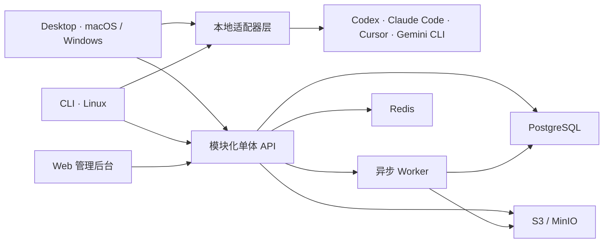

# CapaPort

CapaPort 是面向研发团队的组织级 AI 能力管理平台。它把 Skill、Prompt 和项目上下文统一为“能力包”，覆盖从本地发现、敏感信息扫描、沉淀审核，到跨 Agent 安装与安全更新的完整闭环。

产品由 macOS/Windows 桌面客户端、Linux CLI、Web 管理后台和 Docker 化云端服务组成。首批适配 Codex、Claude Code、Cursor 与 Gemini CLI；支持个人、组织、团队、项目四类空间，一个项目空间可绑定多个本地目录，但不会上传业务源码。

## 架构



后端按账号、组织、空间、能力包、审核发布、分发安装、审计分析等领域模块组织，但以模块化单体方式部署。所有租户查询在服务端强制限定组织边界。

## 一键本地运行

要求：Docker Desktop 或 Docker Engine + Compose v2。克隆仓库后执行：

```bash
docker compose -f infra/compose/compose.yaml up -d --build --wait
```

打开：

- Web 管理后台：<http://127.0.0.1:1430>
- API 健康检查：<http://127.0.0.1:3210/api/v1/health/ready>
- 开发邮件箱：<http://127.0.0.1:8025>

开发环境登录验证码会进入 Mailpit。默认凭据只用于本地开发，不得用于生产。停止并保留数据用 `pnpm docker:down`；连同数据卷清理用：

```bash
docker compose -f infra/compose/compose.yaml down -v
```

## 从源码开发

要求 Node.js 22、pnpm 11.16、Rust stable（仅桌面原生端需要）和 Docker。

```bash
corepack enable
pnpm install --frozen-lockfile
pnpm build
pnpm test
pnpm dev
```

常用入口：

```bash
pnpm --filter @capaport/web dev
pnpm --filter @capaport/desktop dev
pnpm --filter @capaport/cli build
node apps/cli/dist/capaport.mjs --help
```

桌面原生开发运行：

```bash
pnpm --dir apps/desktop exec tauri dev
```

## 验证与发布

```bash
pnpm security:gate       # 依赖、凭据、租户与安全回归门禁
pnpm stack:smoke         # 容器、迁移、备份恢复、持久化烟测
pnpm acceptance          # 十步真实业务验收，使用独立空数据卷
pnpm release:verify      # 完整发布前校验
pnpm artifacts:cli       # 生成 CLI 与 SHA-256 校验文件
```

Git 标签 `v*` 会触发发布流水线，产出 macOS、Windows 桌面包、Linux 可运行 CLI 以及带 SBOM/来源证明的多架构后端镜像。

## 文档

- [用户快速开始](docs/user-guide/getting-started.md)
- [能力包与更新冲突](docs/user-guide/capabilities.md)
- [桌面端与本地适配器](docs/user-guide/desktop.md)
- [Linux CLI](docs/user-guide/cli.md)
- [管理员部署](docs/admin-guide/setup.md)
- [组织、空间和治理](docs/admin-guide/governance.md)
- [安全基线](docs/admin-guide/security.md)
- [运维与可观测性](docs/admin-guide/operations.md)
- [发布签名](docs/admin-guide/release-signing.md)
- [最终验收报告](docs/acceptance-report.md)

## 仓库布局

```text
apps/              API、Worker、Web、Desktop、CLI
adapters/          Codex、Claude Code、Cursor、Gemini CLI
packages/          契约、领域类型、能力包、扫描器、适配器 SDK
infra/             Docker、Compose、部署与秘密配置样例
scripts/           安全、镜像、烟测、验收、备份恢复脚本
tests/acceptance/  跨端、跨租户最终验收
docs/              设计、用户、管理员和运维文档
```

## 许可

当前仓库为私有产品工程，未授予对外开源许可。
