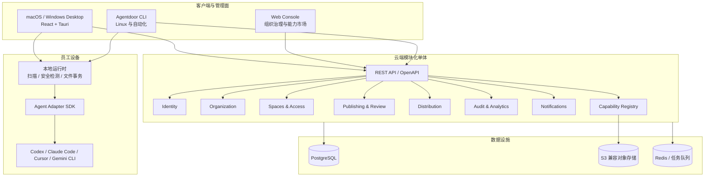
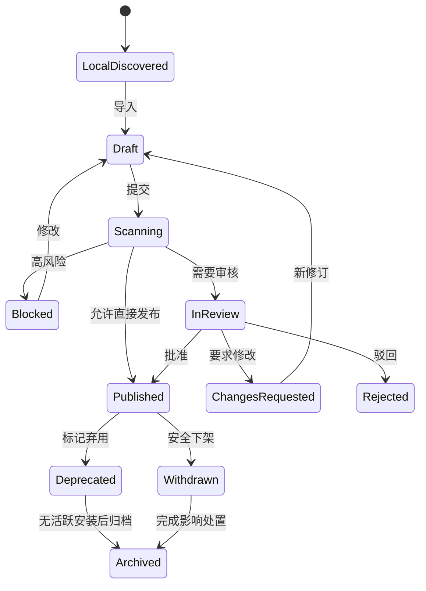
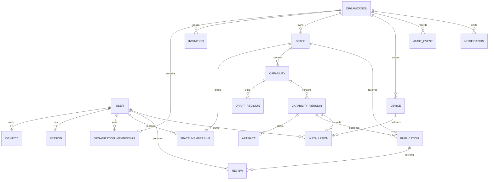
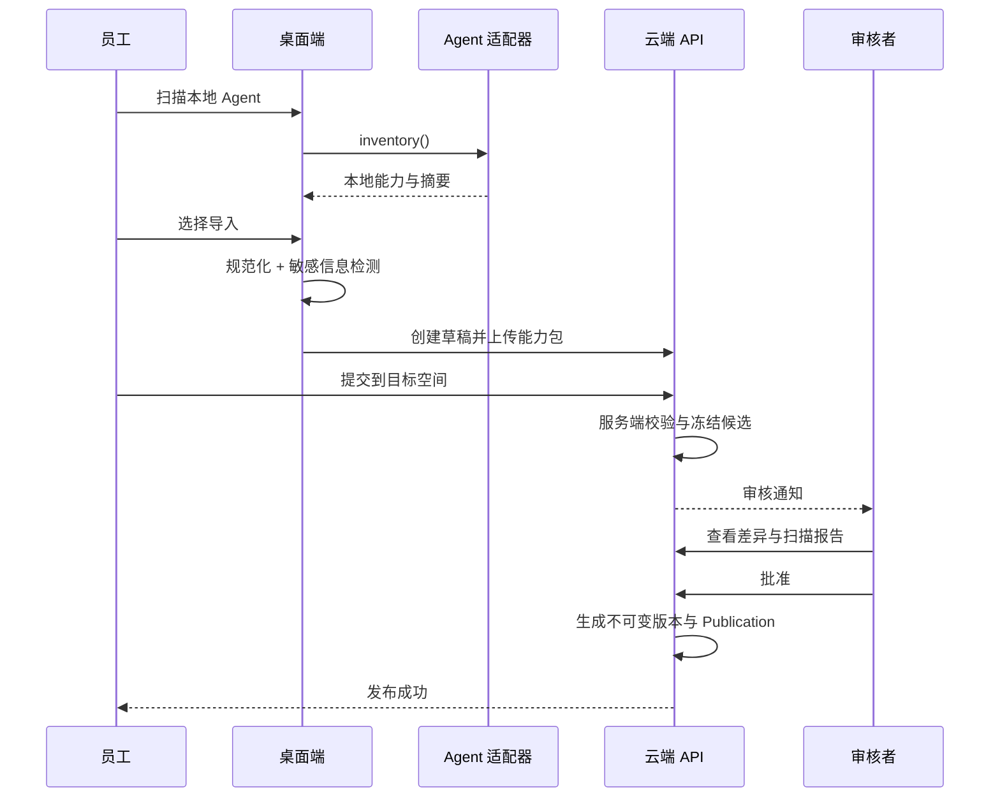
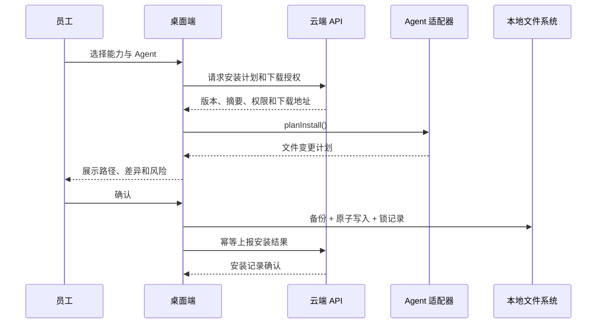

# Agentdoor 产品与技术架构设计

日期：2026-08-07

状态：待最终评审

关联文档：[PRD-Agentdoor.md](../../../PRD-Agentdoor.md)

## 1. 决策摘要

Agentdoor 采用“桌面客户端 + 云端服务 + Web 管理后台 + CLI”的产品形态。云端首版采用模块化单体，不提前拆微服务；桌面端使用平台中立能力包和本地 Agent 适配器连接 Codex、Claude Code、Cursor、Gemini CLI。

已确定的核心决策：

1. 首批用户为研发团队和 AI 高阶用户。
2. MVP 验证“发现 → 沉淀 → 审核 → 安装 → 更新”闭环。
3. 统一资产为能力包，可包含 Skill、Prompt 和项目上下文。
4. 支持个人、团队、项目、组织四类空间。
5. 个人空间自由保存；团队和项目可配置审核；组织级发布强制审核。
6. 云端加密存储完整能力包；桌面端上传前执行敏感信息检测。
7. 项目空间可绑定多个本地目录，但不上传业务源码。
8. macOS、Windows 提供桌面端；Linux 首版提供 CLI。
9. 参考 Skill Zoo 的本地能力管理经验，但不 Fork 其产品结构。

## 2. 设计原则

- **平台中立**：云端能力格式不绑定任何单一 Agent。
- **组织优先**：账号、租户、权限、审核和审计是主干，不是后补功能。
- **本地安全**：桌面端只操作用户确认的目录，写文件可预览、可恢复、不静默覆盖。
- **不可变发布**：已发布版本不可修改，所有更新产生新版本。
- **最小权限**：能力继承空间权限；MVP 不提供单条能力 ACL。
- **显式同步**：默认不上传项目文件，只有用户选择的规则与上下文进入能力包。
- **可演进单体**：云端按领域隔离代码与数据访问，达到拆分条件后再独立部署。
- **契约驱动**：桌面、Web、CLI 与云端共享版本化 API、能力包和适配器契约。

## 3. 总体架构



### 3.1 技术选型

| 层 | 选择 | 原因 |
| --- | --- | --- |
| Monorepo | pnpm workspace + Turborepo | TypeScript 工作区成熟，任务缓存和包边界清晰 |
| 桌面 UI | React + TypeScript + Vite | 与参考项目方向一致，适合复杂本地管理 UI |
| 桌面壳 | Tauri 2 + Rust | 体积小、跨平台、具备受控文件系统与签名更新能力 |
| Web | React + TypeScript | 与桌面共享 UI、类型和领域展示组件 |
| 云端 API | NestJS 模块化单体，Fastify 适配器 | 领域模块、Guard、OpenAPI、队列和测试支持完整 |
| 数据库 | PostgreSQL | 事务、约束、JSON 和审计查询能力适合多租户业务 |
| 数据访问 | 显式 Repository + 类型安全 ORM | 限制跨模块表访问，便于租户条件统一注入 |
| 对象存储 | S3 兼容存储 | 能力包大文件与数据库分离，支持预签名上传和内容摘要 |
| 缓存与队列 | Redis | 限流、短期缓存、邮件短信与扫描任务 |
| API 契约 | OpenAPI + 生成式 TypeScript SDK | 桌面、Web、CLI 避免手写接口漂移 |
| CLI | TypeScript，构建为可分发命令 | 复用 contracts、capability-kit 和 adapter-sdk |
| 后端交付 | Docker / OCI 镜像 | API、Worker、迁移入口一致，支持单机、托管容器和 Kubernetes |

具体依赖版本在实现计划中锁定，架构不依赖某个短期版本特性。

## 4. 代码仓库结构

```text
agentdoor/
├── apps/
│   ├── desktop/                 # React UI + Tauri 壳
│   │   ├── src/                 # 页面、查询、状态、桌面 API 客户端
│   │   └── src-tauri/           # Rust 命令、本地数据库、文件事务、自动更新
│   ├── web/                     # Web 管理后台与组织能力市场
│   ├── api/                     # NestJS 模块化单体
│   └── cli/                     # Linux 和自动化入口
├── packages/
│   ├── contracts/               # OpenAPI 生成类型、事件契约、错误码
│   ├── domain-types/            # 无框架的共享值对象和枚举
│   ├── capability-kit/          # manifest、打包、摘要、差异、校验
│   ├── adapter-sdk/             # Agent 适配器接口、测试套件
│   ├── security-scan/           # 客户端和服务端可复用的扫描规则
│   ├── ui/                      # 跨桌面与 Web 的视觉组件
│   ├── i18n/                    # 中文与英文资源
│   └── config/                  # lint、format、tsconfig、test 配置
├── adapters/
│   ├── codex/
│   ├── claude-code/
│   ├── cursor/
│   └── gemini-cli/
├── infra/
│   ├── docker/                  # 多阶段 Dockerfile、启动入口和健康检查
│   ├── compose/                 # 本地 API、Worker、PostgreSQL、Redis、对象存储、邮件捕获
│   ├── migrations/              # 数据库迁移入口
│   └── deploy/                  # 环境无关部署清单
├── docs/
│   ├── architecture/
│   ├── capability-spec/
│   └── runbooks/
└── tests/
    ├── e2e/
    ├── tenancy/
    ├── security/
    └── fixtures/
```

业务模块不得从 `apps/*` 相互源码引用。共享逻辑只能通过 `packages/*` 公开接口进入，避免桌面、Web 与 API 形成隐式耦合。

## 5. 云端领域模块

### 5.1 Identity

职责：全局账号、邮箱/手机身份、凭据、验证、会话、刷新令牌、设备撤销和登录安全。

公开能力：

- 注册、验证、登录、退出、找回。
- 短期访问令牌与旋转刷新令牌。
- 会话和设备列表、单设备撤销、全部退出。
- 身份提供商抽象，为后续 OIDC、SAML 和 LDAP 保留入口。

边界：Identity 不判断组织业务权限，只提供稳定 `user_id` 与经过验证的身份声明。

### 5.2 Organization

职责：组织、组织成员、邀请、组织角色、组织状态和所有权转移。

组织角色：

- Owner：组织所有权、管理员任命、组织关闭与所有权转移。
- Admin：成员、空间、组织策略与组织级审核。
- Auditor：只读查看安全报告和审计日志。
- Member：使用组织能力并参与授权空间。

一个账号可以加入多个组织。每次 API 请求都必须带当前组织上下文；业务服务只能使用服务端解析后的 `organization_id`。

### 5.3 Spaces & Access

职责：空间、空间成员、角色、审核策略和授权判断。

空间类型：

- Personal：组织内每位成员的私有工作区。
- Team：稳定职能团队。
- Project：临时或跨团队项目，可关联多台设备上的多个本地目录。
- Organization：组织级能力市场，全体有效成员可读。

空间角色：

- Manager：管理成员、设置和审核策略。
- Reviewer：执行该空间的内容审核。
- Contributor：创建、编辑和提交能力。
- Viewer：查看、下载和安装已发布能力。

权限判断顺序：

1. 验证账号和组织成员状态。
2. 验证资源的 `organization_id` 与当前组织一致。
3. 计算组织角色提供的管理权限。
4. 计算空间类型、成员关系和空间角色。
5. 应用空间审核策略与资源状态限制。
6. 记录敏感操作审计事件。

MVP 不提供单个能力包 ACL、外部访客和跨组织共享。组织 Owner 和 Admin 不默认读取成员个人空间正文；只有安全事件、合规策略或成员主动提交后才能进入组织治理流程。

### 5.4 Capability Registry

职责：能力包、版本、内容清单、对象存储、标签、兼容性、依赖、派生关系和全文检索元数据。

核心规则：

- `Capability` 是稳定身份；`CapabilityVersion` 是不可变内容快照。
- 草稿通过新的 `DraftRevision` 保存，发布时冻结为版本。
- 版本号采用语义化版本，但由产品规则协助用户选择升级级别。
- 每个文件有 SHA-256 摘要；整个包有规范化内容摘要。
- 相同组织内相同内容摘要可去重存储，但权限仍由业务记录决定。
- 删除已发布版本使用下架或归档，不物理破坏审计引用。

### 5.5 Publishing & Review

职责：提交、扫描、审核、发布、驳回、撤回、下架和弃用。

空间策略：

- Personal：不需要审核，只能形成私有草稿和私有版本。
- Team / Project：Manager 可选择直接发布或强制审核。
- Organization：始终需要至少一名有权限的 Reviewer 或 Admin 批准。

提交时冻结候选内容，审核期间不得原地修改。修改意见通过新修订重新提交，保证审核对象稳定。

### 5.6 Distribution

职责：兼容性解析、下载授权、安装计划、更新检查、撤回影响、设备与安装记录。

服务端只生成安装计划与授权下载地址，不直接操作员工文件。桌面或 CLI 负责本地事务和适配器调用，并回报匿名化结果、版本和错误分类。

### 5.7 Audit & Analytics

职责：安全审计事件、产品使用事件、聚合指标和数据保留。

审计事件和产品分析事件分开存储：

- 审计事件不可由普通业务用户修改，记录主体、组织、动作、资源、结果、设备、时间和请求关联标识。
- 产品事件只收集实现成功指标所需的最少数据，不采集能力正文和本地绝对路径。

### 5.8 Notifications

职责：站内通知、邮件和短信发送，处理邀请、审核、发布、更新、下架与安全告警。

通知由领域事件触发，不允许业务模块在事务中直接调用外部邮件或短信提供商。

## 6. 能力包规范

### 6.1 规范目录

```text
capability-package/
├── agentdoor.yaml              # 必须：平台中立清单
├── README.md                   # 必须：用途、安装后行为和示例
├── skills/                     # 可选：Skill 内容
├── prompts/                    # 可选：Prompt 内容与变量声明
├── context/                    # 可选：项目规则与知识
├── scripts/                    # 可选：明确声明的辅助脚本
├── assets/                     # 可选：模板和静态资源
└── tests/                      # 可选：能力自身的验证样例
```

### 6.2 Manifest 主要字段

```yaml
schemaVersion: agentdoor.io/v1alpha1
kind: CapabilityPackage
metadata:
  slug: secure-release-helper
  name: 安全发布助手
  description: 发布前执行检查并生成发布摘要
  tags: [release, security]
spec:
  components:
    - type: skill
      path: skills/release
    - type: prompt
      path: prompts/release-summary.md
    - type: context
      path: context/release-policy.md
  compatibility:
    agents: [codex, claude-code, cursor, gemini-cli]
  permissions:
    filesystem: read-project
    network: none
  entrypoints:
    default: skills/release/SKILL.md
  dependencies: []
```

清单禁止存储密钥、个人绝对路径和组织外部下载凭据。适配器专属配置放入命名空间扩展字段，由 `capability-kit` 保留但不让其他适配器误解释。

### 6.3 版本状态



已发布版本不可回到草稿。安全下架不删除安装记录，客户端下一次同步必须显示原因和建议动作。

### 6.4 版本与派生

- Patch：文案、示例或兼容修复，不改变使用约定。
- Minor：新增向后兼容能力或 Agent 支持。
- Major：行为、权限、入口或安装结构存在破坏性变化。
- Fork：从其他能力建立独立维护线，记录来源版本与派生人。
- Promote：把同一候选版本发布到更高范围空间，不复制二进制内容，但生成独立 Publication 和审核记录。

## 7. 本地运行时与 Agent 适配器

### 7.1 适配器接口

每个适配器实现同一组能力：

```ts
interface AgentAdapter {
  id: string;
  detect(): Promise<AgentInstallation[]>;
  inventory(target: AgentInstallation): Promise<LocalCapability[]>;
  import(local: LocalCapability): Promise<CanonicalPackage>;
  planInstall(pkg: CanonicalPackage, target: InstallTarget): Promise<FilePlan>;
  validatePlan(plan: FilePlan): Promise<ValidationResult>;
  apply(plan: FilePlan, tx: FileTransaction): Promise<InstallResult>;
  uninstall(lock: InstallLock, tx: FileTransaction): Promise<InstallResult>;
}
```

适配器不负责登录、云端权限、发布审核或审计。它只处理某个 Agent 的检测、格式转换和文件计划。

### 7.2 本地数据

设备端使用轻量本地数据库保存：

- 已登录账号与组织的非敏感缓存。
- Agent 安装位置与能力清单摘要。
- 本地目录绑定；绝对路径只存在本机。
- 安装锁文件、文件摘要、备份位置和同步游标。
- 待重试操作与幂等键。

刷新令牌存入操作系统安全凭据存储，不进入普通配置文件和日志。

### 7.3 文件事务

所有安装、更新和卸载使用统一文件事务：

1. 解析并校验目标路径在适配器允许根目录内。
2. 生成新增、修改、删除的预览和内容摘要。
3. 检测目标文件是否在上次安装后被本地修改。
4. 对受影响文件建立可恢复备份。
5. 写入临时目录并校验，再使用原子替换提交。
6. 写入安装锁记录。
7. 失败时回滚；回滚失败进入“需要人工恢复”状态并显示备份位置。

用户本地修改与新版本冲突时不自动覆盖。用户可选择保留本地版本、查看差异、导入为新草稿或确认覆盖。

### 7.4 项目目录绑定

- 一个项目空间可以绑定同一设备的多个本地目录。
- 云端保存设备与项目空间的关联标识，不保存绝对路径。
- 默认忽略 `.git`、依赖目录、构建产物、二进制文件和常见密钥文件。
- 用户必须从允许清单中选择同步文件；选择目录时显示预计文件数和大小。
- 客户端设置文件数、单文件大小、总大小和扩展名上限。
- 上下文导出前再次执行敏感信息检测。

## 8. 核心数据模型



### 8.1 关键约束

- 除全局账号表外，组织业务表必须包含 `organization_id`。
- 数据库唯一约束同时包含 `organization_id`，避免跨租户冲突与误引用。
- 外键不得跨组织，Repository 在写入前检查父资源组织一致。
- `CapabilityVersion` 内容摘要、版本号和发布时间一经发布不可更新。
- `Review` 保留候选摘要，确保审核意见对应准确内容。
- `AuditEvent` 采用追加写入，不提供业务更新接口。
- 设备只保存稳定随机标识和展示名称，不上传硬件序列号。

## 9. API 与事件契约

### 9.1 API 规则

- REST JSON API，使用 `/api/v1` 前缀。
- 访问令牌声明账号，不直接声明客户端可控的目标组织。
- 当前组织由受保护请求头和服务端 Membership 校验共同解析。
- 所有写接口支持 `Idempotency-Key`，桌面离线重试不会重复发布或安装记录。
- 列表采用游标分页；搜索和审计接口限制最大时间范围与结果量。
- 错误响应统一包含 `code`、`message`、`requestId` 和可选的字段错误。
- 客户端只根据稳定错误码判断流程，不解析自然语言错误文本。

### 9.2 主要资源

```text
/auth/*
/organizations/*
/organizations/{orgId}/members/*
/spaces/*
/spaces/{spaceId}/members/*
/capabilities/*
/capabilities/{id}/drafts/*
/capabilities/{id}/versions/*
/publications/*
/reviews/*
/distribution/install-plans/*
/devices/*
/installations/*
/audit-events/*
/analytics/*
/notifications/*
```

对象上传采用“申请上传 → 预签名上传 → 服务端确认摘要”的三步协议。只有确认完成且扫描通过的对象才能关联到候选版本。

### 9.3 领域事件

模块间通过事务内事件记录和后台分发协作：

- `OrganizationMemberInvited`
- `CapabilityDraftSubmitted`
- `CapabilityScanBlocked`
- `PublicationReviewRequested`
- `PublicationApproved`
- `CapabilityVersionPublished`
- `CapabilityVersionWithdrawn`
- `InstallationReported`
- `UpdateAvailable`

事件写入与业务事务共同提交，再由后台任务可靠处理通知、统计和后续扫描。消费者必须幂等。

## 10. 关键业务流程

### 10.1 发现到发布



### 10.2 安装与更新



更新流程复用安装事务，但先比较上次安装摘要与当前本地摘要。存在本地修改时必须进入冲突处理，不允许静默覆盖。

## 11. 安全架构

### 11.1 身份与会话

- 邮箱和手机号均需验证后才能成为登录身份。
- 密码使用成熟库提供的内存困难型密码哈希；禁止自研密码算法。
- 访问令牌短期有效；刷新令牌每次使用后轮换，旧令牌复用触发会话链撤销。
- 登录、验证、邀请和找回接口使用账号、IP 和设备多维限流。
- 高风险管理操作要求近期重新验证身份。

### 11.2 租户与权限

- 应用层强制组织上下文，Repository 默认注入 `organization_id`。
- 关键表可增加数据库行级安全作为纵深防护，但不能替代应用授权。
- 每个权限动作有自动化正向和反向测试，尤其覆盖猜测 ID、跨组织和失效成员。
- Owner、Admin、Reviewer 等高权限变化写入安全审计。

### 11.3 能力包安全

客户端扫描：

- 常见 API Key、私钥、访问令牌和连接串模式。
- 高熵字符串与敏感文件名。
- 个人身份、内部地址和自定义组织禁用词规则。
- 可执行脚本、网络访问声明和超出包根目录的引用。

服务端扫描：

- 压缩包炸弹、文件数量、大小和路径穿越。
- 内容摘要与上传声明不一致。
- 符号链接、设备文件、未声明二进制和危险扩展名。
- 已知恶意内容或组织策略命中。

高风险结果阻止上传或发布；允许确认的中风险结果必须记录确认人、理由和扫描规则版本。

### 11.4 加密与隐私

- 传输使用 TLS。
- PostgreSQL、对象存储和备份启用云端加密。
- 对象使用随机不可猜测键，不使用原始文件名作为存储路径。
- 预签名上传和下载地址短期有效，并绑定操作范围。
- 日志、指标和分析事件禁止记录能力正文、令牌、手机号全文和本地绝对路径。
- 数据导出、成员移除和组织关闭有明确保留与删除流程。

### 11.5 桌面安全

- Tauri 只暴露白名单命令和最小文件系统能力。
- WebView 不直接获得任意磁盘读取权限。
- 所有路径在 Rust 层规范化后再执行操作。
- 安装包和自动更新必须签名；更新源使用 HTTPS 和固定发布身份。
- 本地令牌存储在 Keychain 或 Windows Credential Manager。

## 12. 错误处理与离线策略

### 12.1 错误分类

- `AUTH_*`：登录、验证、会话和身份错误。
- `ACCESS_*`：组织、空间和动作权限错误。
- `CAPABILITY_*`：能力格式、版本和状态错误。
- `SCAN_*`：客户端或服务端安全扫描错误。
- `ADAPTER_*`：Agent 检测、兼容和格式转换错误。
- `FILE_TX_*`：路径、冲突、写入和回滚错误。
- `SYNC_*`：离线、游标、幂等和重试错误。

每个错误向用户说明“发生了什么、哪些数据受到影响、下一步可以做什么”。原始堆栈只进入脱敏诊断日志。

### 12.2 离线行为

- 桌面端离线时仍可扫描本地 Agent、浏览已缓存能力和编辑本地草稿。
- 发布、审核和下载新能力需要在线。
- 待同步写操作进入本地队列，恢复网络后按幂等键重试。
- 权限撤销后，离线缓存不得继续授予新的安装操作；已安装本地文件按组织策略提示处理。
- 同步游标失效时执行受控全量元数据同步，不重新上传正文。

## 13. Web 与桌面信息架构

### 13.1 桌面端

```text
首页
├── 本地 Agent 状态
├── 待处理更新与冲突
└── 最近使用的能力
能力库
├── 我的能力
├── 团队 / 项目能力
├── 组织能力市场
└── 已安装
项目
├── 项目空间
├── 本地目录绑定
└── 上下文同步范围
发布
├── 草稿
├── 提交记录
└── 扫描报告
设置
├── 账号与组织
├── Agent 与路径
├── 安全和隐私
└── 更新与诊断
```

### 13.2 Web 管理后台

```text
组织概览
能力市场
审核中心
空间管理
├── 团队空间
└── 项目空间
成员与邀请
安全中心
├── 风险报告
├── 下架处置
└── 审计日志
使用分析
组织设置
```

## 14. 后台任务与一致性

后台任务包括邮件短信、服务端扫描、对象清理、搜索索引、更新通知、统计聚合和审计归档。

一致性规则：

- 能力版本发布、Publication 和审计事件在同一数据库事务中完成。
- 对象上传可以先于数据库确认，但未确认对象定期清理。
- 通知和统计允许最终一致；发布权限与下载授权必须强一致。
- 所有后台任务包含幂等键、最大重试次数和死信状态。
- 失败任务进入管理员可见的运维队列，不无限静默重试。

## 15. 可观测性与运维

- 所有请求生成 `request_id`，跨 API、队列任务和审计事件关联。
- 关键指标：注册成功率、邀请接受率、扫描耗时、发布成功率、审核时长、安装成功率、更新采用率和文件事务回滚率。
- 关键告警：跨租户授权拒绝异常升高、扫描服务积压、对象确认失败、安装失败率升高、刷新令牌复用和审计写入失败。
- 结构化日志统一脱敏；桌面诊断包由用户明确触发并预览后导出。
- 数据库迁移采用向前兼容步骤，应用发布前完成备份和回滚演练。

## 16. 测试策略

### 16.1 单元测试

- 能力清单解析、规范化摘要、语义版本和差异计算。
- 权限矩阵、审核状态机和版本状态机。
- 敏感信息规则、路径规范化和文件计划。
- 每个 Agent 适配器的 fixture 契约测试。

### 16.2 集成测试

- PostgreSQL 约束、事务事件和 Repository 租户条件。
- 对象上传确认、摘要不一致和孤儿清理。
- 刷新令牌轮换、邀请过期、成员失效和权限撤销。
- 队列幂等、重试和死信。

### 16.3 端到端测试

- 注册 → 创建组织 → 邀请成员 → 加入组织。
- 本地发现 → 导入 → 扫描 → 提交 → 审核 → 发布。
- 搜索 → 安装 → 本地修改 → 新版本 → 冲突处理 → 更新。
- 项目空间绑定多个目录并只同步允许内容。
- 能力紧急下架后已安装客户端收到处置提示。

### 16.4 安全测试

- 全部 API 的跨组织 ID 猜测和越权访问。
- 路径穿越、符号链接逃逸、压缩包炸弹和恶意文件名。
- 密钥、令牌、私钥和高熵内容检测。
- 会话固定、刷新令牌重放、邀请令牌重放和限流。
- 桌面端命令白名单、更新签名和本地凭据保护。

### 16.5 发布门禁

- TypeScript、Rust 类型和静态检查通过。
- 单元、集成、E2E 和适配器契约测试通过。
- 数据库迁移在干净库和上一版本快照上通过。
- API、Worker 和迁移容器镜像能够从干净环境构建并通过漏洞扫描。
- Docker Compose 全栈启动、健康检查、优雅停止和重启恢复测试通过。
- 桌面 macOS、Windows 安装、升级和卸载冒烟测试通过。
- 租户隔离与高危安全用例零失败。

## 17. 部署架构

MVP 后端采用 Docker-first 交付。源码只构建一次，使用多阶段 Dockerfile 生成标准 OCI 镜像，并通过不同启动命令运行三个容器角色：

- `agentdoor-api`：无状态 HTTP API，可水平扩展。
- `agentdoor-worker`：异步扫描、通知、索引、统计与清理任务，可按队列独立扩容。
- `agentdoor-migrate`：一次性数据库迁移任务；部署时先执行，成功后再更新 API 和 Worker。

三个角色使用同一提交和依赖锁文件构建，镜像标签包含语义版本与 Git 提交摘要。生产环境禁止使用浮动的 `latest` 标签。

### 17.1 Docker 镜像规范

- 使用多阶段构建，只把生产依赖和编译产物带入运行镜像。
- 容器使用固定 UID 的非 root 用户运行，根文件系统默认只读。
- 临时文件写入明确挂载的临时目录；业务数据不写入容器层。
- 镜像中不包含 `.env`、源码仓库凭据、云密钥或生产配置。
- 运行配置通过环境变量和 Secret 挂载注入，并在启动时完成结构化校验。
- 提供 `/health/live` 与 `/health/ready`；就绪检查包含数据库和必要依赖状态，存活检查不依赖外部服务。
- API 和 Worker 接收终止信号后停止接收新任务，等待在途事务在超时内完成。
- 构建生成 SBOM，执行依赖与镜像漏洞扫描；发布镜像写入 OCI 来源、版本和提交标签。
- 首版构建 `linux/amd64` 与 `linux/arm64`，保证常见云主机和 ARM 开发环境可用。

### 17.2 Docker Compose 本地与单机部署

仓库提供一份可直接启动的 Compose 配置，包括：

```text
api
worker
postgres
redis
minio
mailpit
```

Compose 使用健康检查和依赖条件保证启动顺序；数据库迁移由显式的一次性 profile 或发布命令执行，不允许多个 API 实例并发自动迁移。本地开发使用命名卷保存数据库和对象，测试配置使用隔离卷并可完整重建。

单机企业试用可以复用生产化 Compose 覆盖文件，但必须替换默认密码、关闭开发邮件服务、配置 HTTPS 入口和外部备份。Compose 不是高可用生产集群方案。

### 17.3 生产部署

生产环境可运行在托管容器平台或 Kubernetes，并保持相同镜像和健康检查契约：

- PostgreSQL 使用托管高可用实例和时间点恢复。
- Redis 用于限流、缓存与任务，不作为业务事实来源。
- 对象存储启用版本控制、生命周期和服务端加密。
- API 至少运行两个副本；Worker 按任务积压扩容。
- 数据库迁移作为独立发布 Job 串行执行。
- 入口网关终止 TLS，并设置请求体大小、超时和限流。
- Web 静态资产通过 CDN 分发。
- 桌面安装包分别签名并通过受控更新通道发布。

环境分为本地开发、测试、预发布和生产。不同环境使用独立数据库、对象桶、密钥和身份配置，禁止共享生产凭据。

### 17.4 发布与回滚

1. CI 构建并测试镜像，生成 SBOM 和扫描报告。
2. 推送不可变版本镜像到容器仓库。
3. 备份并执行 `agentdoor-migrate`。
4. 先更新少量 API 和 Worker 实例，观察健康检查与核心指标。
5. 完成滚动发布；失败时回退应用镜像。

数据库迁移必须向前兼容上一版应用。需要破坏性变更时采用“扩展 → 双写/回填 → 切换 → 收缩”，不能依赖简单镜像回退恢复旧表结构。

### 17.5 微服务拆分条件

只有满足以下任一条件才拆服务：

- 独立模块出现显著不同的扩容需求。
- 发布节奏或可用性目标要求独立部署。
- 团队规模导致单仓应用发布形成持续瓶颈。
- 安全隔离要求独立运行边界。

优先拆分候选为扫描处理、通知、分析和分发；Identity、Organization、Access 与 Registry 在业务边界稳定前保持同一事务边界。

## 18. MVP 纵向切片顺序

### Slice 1：单用户本地闭环

一个 Agent 适配器、本地发现、能力包规范、安全扫描、草稿、安装与恢复。目标是验证 Canonical Package 和文件事务。

### Slice 2：账号与组织

注册登录、组织、邀请、成员、个人和组织空间、租户隔离测试。目标是建立所有后续功能的安全主干。

### Slice 3：发布与审核

版本冻结、差异、扫描报告、组织级审核、审计和通知。目标是打通个人到组织资产的转换。

### Slice 4：多 Agent 分发

补齐四个适配器、兼容性、安装记录、更新检查和冲突处理。目标是验证跨 Agent 价值。

### Slice 5：团队与项目协作

团队/项目空间、成员角色、多目录绑定和上下文同步。目标是验证组织维度知识共享。

### Slice 6：治理与试点

Web 管理后台、安全中心、基础分析、运维告警、macOS/Windows 签名发布和 Linux CLI。目标是进入真实团队试点。

每个切片都必须包含 UI、API、数据迁移、权限、安全、测试和可观测性，不把质量工作集中到最后。

## 19. 明确延后事项

以下能力不进入 MVP：模型调用与 Agent 执行托管、业务源码索引、外部访客、跨组织共享、评论评分、计费、语义搜索、知识问答、企业 SSO/SCIM、私有部署和第三方插件市场。

延后不代表架构忽略：Identity 保留身份提供商接口，能力包有 schemaVersion，Adapter SDK 可增加实现，Publication 可扩展分发目标，部署保持无状态 API 与外置数据设施。

## 20. 最终验收场景

使用两个普通成员和一个审核者完成以下流程：

1. 成员 A 注册、创建组织并邀请成员 B 与审核者。
2. 成员 A 的桌面端发现 Codex 本地 Skill，并导入个人空间。
3. 客户端发现一个测试密钥并阻止上传；移除密钥后扫描通过。
4. 成员 A 把包含 Skill、Prompt 和项目上下文的能力包提交到组织空间。
5. 审核者查看差异与扫描报告后批准发布。
6. 成员 B 在组织能力市场搜索并安装到 Claude Code。
7. 成员 A 发布新版本；成员 B 本地无修改时成功更新。
8. 成员 B 修改本地文件后再次更新，系统阻止静默覆盖并提供差异、导入草稿和恢复选项。
9. 管理员能在审计日志看到邀请、提交、审核、发布、下载、安装和更新事件。
10. 使用另一个组织账号尝试访问上述资源时全部被拒绝，且不会通过搜索或错误信息泄露资源存在。

上述流程全部通过，才视为 Agentdoor MVP 主闭环完成。
